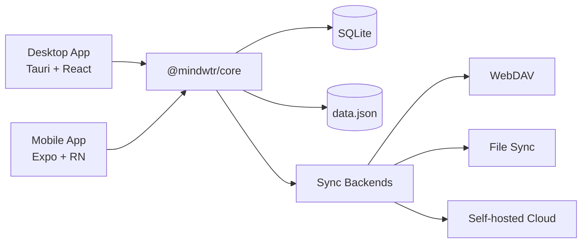

# Architecture

Technical architecture and design decisions for Mindwtr.

---

## Overview

Mindwtr is a cross-platform GTD application with:

- **Desktop app** — Tauri v2 (Rust + React)
- **Mobile app** — React Native + Expo
- **Cloud Sync** — Node.js (Bun) sync server
- **Shared core** — TypeScript business logic package

```
┌─────────────────────────────────────────────────────────┐
│                       User Interface                      │
├─────────────────────────────┬───────────────────────────┤
│      Desktop (Tauri)        │      Mobile (Expo)        │
│   React + Vite + Tailwind   │  React Native + NativeWind│
├─────────────────────────────┴───────────────────────────┤
│                     @mindwtr/core                        │
│    Zustand Store · Types · i18n · Utils · Sync          │
├─────────────────────────────┬───────────────────────────┤
│    Tauri FS (Rust)          │   SQLite + JSON backup    │
│    SQLite + JSON backup     │     App storage           │
└──────────────┬──────────────┴───────────────────────────┘
               │
┌──────────────▼──────────────┐
│        Cloud / Sync         │
│   WebDAV / Local / Server   │
└─────────────────────────────┘
```

## Design Trade-offs

- **Cloud sync is file-based** and optimized for single-machine self-hosting.
- **SQLite foreign keys are not enforced** so soft-delete + sync merges can be handled explicitly in the app layer.

### System Diagram (Mermaid)



---

## Monorepo Structure

The project uses a monorepo with Bun workspaces:

```
Mindwtr/
├── apps/
│   ├── cloud/           # Sync server (Bun)
│   ├── desktop/         # Tauri app
│   └── mobile/          # Expo app
├── packages/
│   └── core/            # Shared business logic
└── package.json         # Workspace root
```

### Benefits

- Shared code between platforms
- Single version of dependencies
- Unified testing and CI
- Easier refactoring

---

## Core Package (`@mindwtr/core`)

The core package contains all shared business logic:

### Modules

| Module              | Purpose                                       |
| ------------------- | --------------------------------------------- |
| `store.ts`          | Zustand state store with all actions          |
| `types.ts`          | TypeScript interfaces (Task, Project, etc.)   |
| `i18n.ts`           | Translation strings and loading               |
| `contexts.ts`       | Preset contexts and tags                      |
| `quick-add.ts`      | Natural language task parser                  |
| `recurrence.ts`     | Recurring task logic (RFC 5545 partial)       |
| `sync.ts`           | Data merge utilities (LWW + Tombstones)       |
| `date.ts`           | Safe date parsing utilities                   |
| `ai/`               | AI integration (Gemini/OpenAI/Anthropic)      |
| `sqlite-adapter.ts` | Local storage adapter interface               |
| `webdav.ts`         | WebDAV sync client                            |

### Design Principles

1. **Platform agnostic** — No platform-specific code
2. **Storage adapter pattern** — Inject storage at runtime
3. **Pure functions** — Utilities are stateless
4. **Type safety** — Full TypeScript coverage

### State Layering

- **Core store** keeps canonical data (`all tasks/projects`).
- **UI stores** hold view-specific filters and UI state.
- **Visible lists** are derived from core data + UI filters to avoid mixing persistence concerns with presentation.

---

## Desktop Architecture (Tauri)

### Why Tauri?

| Feature      | Tauri  | Electron         |
| ------------ | ------ | ---------------- |
| Binary size  | ~5 MB  | ~150 MB          |
| Memory usage | ~50 MB | ~300 MB          |
| Backend      | Rust   | Node.js          |
| Webview      | System | Bundled Chromium |

### Structure

```
apps/desktop/
├── src/                   # React frontend
│   ├── App.tsx           # Root component
│   ├── components/       # UI components
│   │   ├── Layout.tsx    # Sidebar + content
│   │   ├── TaskItem.tsx  # Task component
│   │   └── views/        # View components
│   ├── contexts/         # React contexts
│   ├── store/            # UI-specific state (filters, focus mode)
│   └── lib/              # Utilities
│
├── src-tauri/            # Rust backend
│   ├── src/main.rs       # Entry point
│   ├── Cargo.toml        # Rust dependencies
│   └── tauri.conf.json   # Tauri config
│
└── package.json
```

### Data Flow

```
User Action → React Component → Zustand Store (@mindwtr/core) → Storage Adapter → SQLite + data.json
```

### Tauri Commands

The Rust backend exposes commands for:
- File system operations
- Native dialogs
- System notifications

---

## Mobile Architecture (Expo)

### Why Expo?

- Managed workflow simplifies development
- OTA updates capability
- Expo Router for file-based navigation
- Easy build process (EAS)

### Structure

```
apps/mobile/
├── app/                   # Expo Router pages
│   ├── (drawer)/         # Drawer navigation
│   │   ├── (tabs)/       # Tab navigation
│   │   │   ├── inbox.tsx
│   │   │   ├── next.tsx
│   │   │   └── ...
│   │   ├── projects-screen.tsx
│   │   └── settings.tsx
│   └── _layout.tsx       # Root layout
│
├── components/           # Shared components
├── contexts/             # Theme, Language
├── lib/                  # Storage, sync utilities
└── package.json
```

### Navigation

```
Drawer/Stack Layout
├── Tab Navigator
│   ├── Inbox
│   ├── Agenda
│   ├── Next Actions
│   ├── Projects
│   └── Menu (links to other views)
├── Other Screens (Stack)
│   ├── Board
│   ├── Calendar
│   ├── Review
│   ├── Contexts
│   ├── Waiting For
│   ├── Someday/Maybe
│   ├── Archived
│   └── Settings
```

---

## State Management

### Zustand Store

The central store (`@mindwtr/core/src/store.ts`) manages all application state:

```typescript
interface TaskStore {
    tasks: Task[];
    projects: Project[];
    areas: Area[];
    settings: AppData['settings'];
    
    // Actions
    fetchData: () => Promise<void>;
    addTask: (title: string, props?: Partial<Task>) => Promise<void>;
    updateTask: (id: string, updates: Partial<Task>) => Promise<void>;
    deleteTask: (id: string) => Promise<void>;
    // ... projects, areas, and settings actions
}
```

### Storage Adapter Pattern

The store uses injected storage adapters:

```typescript
// Desktop: Tauri file system
setStorageAdapter(tauriStorage);

// Mobile: SQLite (with JSON backup fallback)
setStorageAdapter(mobileStorage);
```

### Persistence

- **Debounced saves** — Changes are batched and saved after 1 second
- **Flush on exit** — Pending saves are flushed when app backgrounds
- **Soft deletes** — Items are marked with `deletedAt` for sync

---

## Data Model

### Task

```typescript
interface Task {
    id: string;
    title: string;
    status: TaskStatus;  // inbox | next | waiting | someday | done | archived
    priority?: TaskPriority; // low | medium | high | urgent
    startTime?: string;
    dueDate?: string;
    recurrence?: Recurrence | RecurrenceRule;
    tags: string[];
    contexts: string[];
    checklist?: ChecklistItem[];
    description?: string;
    attachments?: Attachment[];
    location?: string;
    projectId?: string;
    isFocusedToday?: boolean;
    timeEstimate?: TimeEstimate;
    reviewAt?: string; // Tickler/review date
    completedAt?: string;
    createdAt: string;
    updatedAt: string;
    deletedAt?: string;  // Tombstone for sync
    pushCount?: number;
    orderNum?: number;
}
```

### Project

```typescript
interface Project {
    id: string;
    title: string;
    status: 'active' | 'someday' | 'waiting' | 'archived';
    color: string;
    areaId?: string;
    tagIds: string[];
    isSequential?: boolean;
    isFocused?: boolean;
    supportNotes?: string;
    attachments?: Attachment[];
    reviewAt?: string;
    createdAt: string;
    updatedAt: string;
    deletedAt?: string;
}
```

### Area

```typescript
interface Area {
    id: string;
    name: string;
    color?: string;
    icon?: string;
    order: number;
    createdAt?: string;
    updatedAt?: string;
}
```

### Attachment

```typescript
interface Attachment {
    id: string;
    kind: 'file' | 'link';
    title: string;
    uri: string;
    createdAt: string;
    updatedAt: string;
    deletedAt?: string;
}
```

---

## Sync Strategy

### Last-Write-Wins (LWW) with Tombstones

Data synchronization relies on merging local and remote datasets based on timestamps (`updatedAt`).

### Merge Logic

1. **Resolution**:
    - If item exists in both: keep the one with newer `updatedAt`.
    - If clock skew is within threshold (5 mins), prefer deletion over modification, otherwise rely on timestamps.
2. **Tombstones**:
    - Deleted items retain their record with `deletedAt` set.
    - Prevents resurrection on sync.
    - Allows proper merge across devices.
3. **Conflicts**:
    - Metadata-level conflicts are resolved automatically.
    - Content-level conflicts (e.g. concurrent edits) follow LWW.

### Sync Cycle

```
1. Read Local Data
2. Read Remote Data (Cloud/WebDAV/File)
3. Merge (Memory) -> Generate Stats (conflicts, updates)
4. Write Local (if changed)
5. Write Remote (if changed)
```

---

## Internationalization

### Structure

Translations are in `packages/core/src/i18n.ts` and `i18n-translations.ts`:

```typescript
export const translations: Record<Language, Record<string, string>> = {
    en: { 'nav.inbox': 'Inbox', ... },
    zh: { 'nav.inbox': '收集箱', ... },
    // ... other languages
};
```

### Usage

Each app has a language context that provides a `t()` function.
