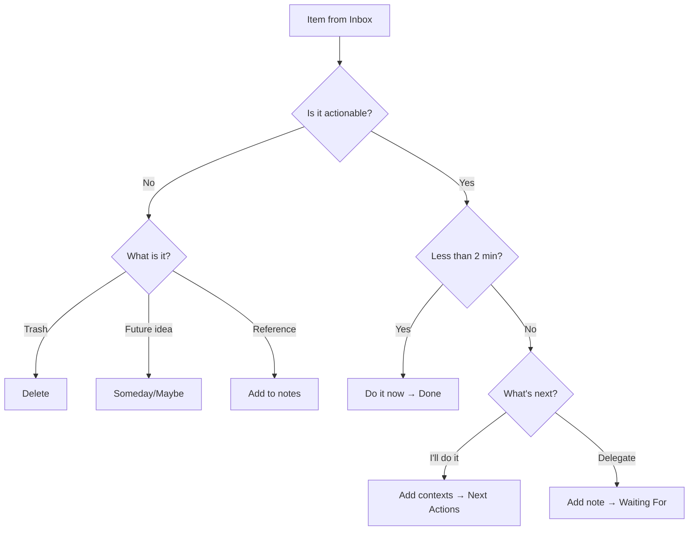

# GTD Workflow in Mindwtr

This guide shows how to implement the GTD methodology using Mindwtr's features.

---

## Overview

Mindwtr maps directly to GTD concepts:

| GTD Concept   | Mindwtr Feature                        |
| ------------- | -------------------------------------- |
| Inbox         | Inbox view                             |
| Clarify       | Processing wizard                      |
| Next Actions  | Focus view (Next Actions list)         |
| Projects      | Projects view                          |
| Waiting For   | Waiting For view (status: `waiting`)   |
| Someday/Maybe | Someday/Maybe view (status: `someday`) |
| Calendar      | Calendar view (tasks with due dates)   |
| Weekly Review | Review wizard                          |

---

## 1. Capture (Inbox)

### Quick Capture

- **Desktop:** Type in the bottom input field or use keyboard shortcut `o`
- **Mobile:** Tap the input field on the Inbox tab

### Quick-Add Syntax

Capture with context immediately:
```
Call plumber @phone @home
Buy groceries @errands /due:saturday
Research topic #focused +WorkProject
```

### The Rule

Capture everything. Don't filter, judge, or organize—just get it out of your head.

---

## 2. Clarify (Processing Wizard)

### Starting the Process

- **Desktop:** Click "Process Inbox" button
- **Mobile:** Tap "Process Inbox" button

### The Workflow



### Decision Points

**Is it actionable?**
- No → Delete, move to Someday/Maybe, or add as reference
- Yes → Continue

**Will it take less than 2 minutes?**
- Yes → Do it immediately, mark Done
- No → Continue

**What's next?**
- I'll do it → Select contexts, move to Next Actions
- Delegate → Add waiting note, move to Waiting For

**Assign a project?** (Optional)
- Link related tasks to a project

---

## 3. Organize

### Task Statuses

| Status     | Meaning            | View          |
| ---------- | ------------------ | ------------- |
| `inbox`    | Not yet processed  | Inbox         |
| `next`     | Ready to do next   | Focus         |
| `waiting`  | Delegated/blocked  | Waiting For   |
| `someday`  | Future/maybe       | Someday/Maybe |
| `done`     | Completed          | Done          |
| `archived` | Finished and filed | Archived      |

### Contexts and Tags

Add contexts to filter by where you can do tasks:

**Location contexts (@):**
- `@home`, `@work`, `@errands`, `@anywhere`
- `@computer`, `@phone`, `@agendas`

**Tags (#):**
- `#focused` — Deep work
- `#lowenergy` — Simple tasks
- `#creative` — Brainstorming
- `#routine` — Repetitive tasks

### Projects

Create projects for multi-step outcomes:

1. Go to Projects view
2. Add a new project with name and color
3. Add tasks to the project
4. (Optional) Create **Sections** to group tasks by phase or sub‑outcome
5. Toggle Sequential/Parallel mode:
   - **Sequential:** Only first task shows in Focus view
   - **Parallel:** All tasks show in Focus view

### Due Dates and Reminders

- Set **due date** for deadlines
- Set **start date** for when to begin
- Set **review date** (tickler) for periodic check-ins

---

## 4. Reflect (Weekly Review)

### Starting the Review

- **Desktop:** Go to Weekly Review in sidebar
- **Mobile:** Tap Review tab or access from drawer

### The Steps

1. **Process Inbox**
   - Clear all inbox items
   - Goal: Inbox Zero

2. **Review Calendar**
   - Look back 2 weeks for missed follow-ups
   - Look ahead 2 weeks for preparation needs

3. **Waiting For**
   - Review delegated items
   - Send reminders if needed

4. **Review Projects**
   - Ensure each project has a next action
   - Mark completed projects as done

5. **Someday/Maybe**
   - Review incubated ideas
   - Activate or delete items

### Best Practice

Schedule 30-90 minutes weekly, same time, same place.

---

### Engage

### Choosing What to Work On

Use the **Focus** view to see:
- Today's focused tasks (starred items)
- Next Actions (context-filtered or general)
- Overdue items
- Due today

### Context Filtering

1. Go to **Focus** or **Contexts** view
2. Select a context chip (e.g., @home)
3. See only tasks for that context

### Today's Focus

Star up to 3 tasks as today's priorities:
- **Desktop:** Click the star icon
- **Mobile:** Tap the star badge

---

## Daily Workflow

### Morning

1. Open **Focus** view to see today's priorities
2. Set up to 3 focus tasks for the day
3. Start working on the first one (mark as Focus)

### Throughout the Day

1. Capture new items to Inbox
2. Check context-filtered lists when switching locations
3. Mark completed tasks as Done

### End of Day

1. Quick scan of Inbox (process if time)
2. Review tomorrow's calendar
3. Update any in-progress tasks

---

## Recurring Tasks

Set up recurring tasks for habits:

1. Edit a task
2. Set recurrence (daily, weekly, monthly, yearly)
3. Choose strategy:
   - **Strict** for fixed schedules (e.g., every 5 days on a fixed cadence)
   - **Repeat after completion** for habits based on when you actually finish
4. When completed, a new instance is created automatically

**Example recurring tasks:**
- Weekly: "Review project status"
- Daily: "Check email @computer"
- Monthly: "Review subscriptions"

---

## Tips for Success

### Trust Your System

- Capture everything immediately
- Process regularly
- Don't skip weekly reviews

### Keep It Simple

- Don't over-organize
- Use contexts sparingly at first
- Add complexity only when needed

### Build Habits

- Same time for weekly review
- Regular inbox processing
- Consistent capture method

---

## See Also

- [[GTD Overview]]
- [[GTD Best Practices]]
- [[Contexts and Tags]]
- [[Weekly Review]]
